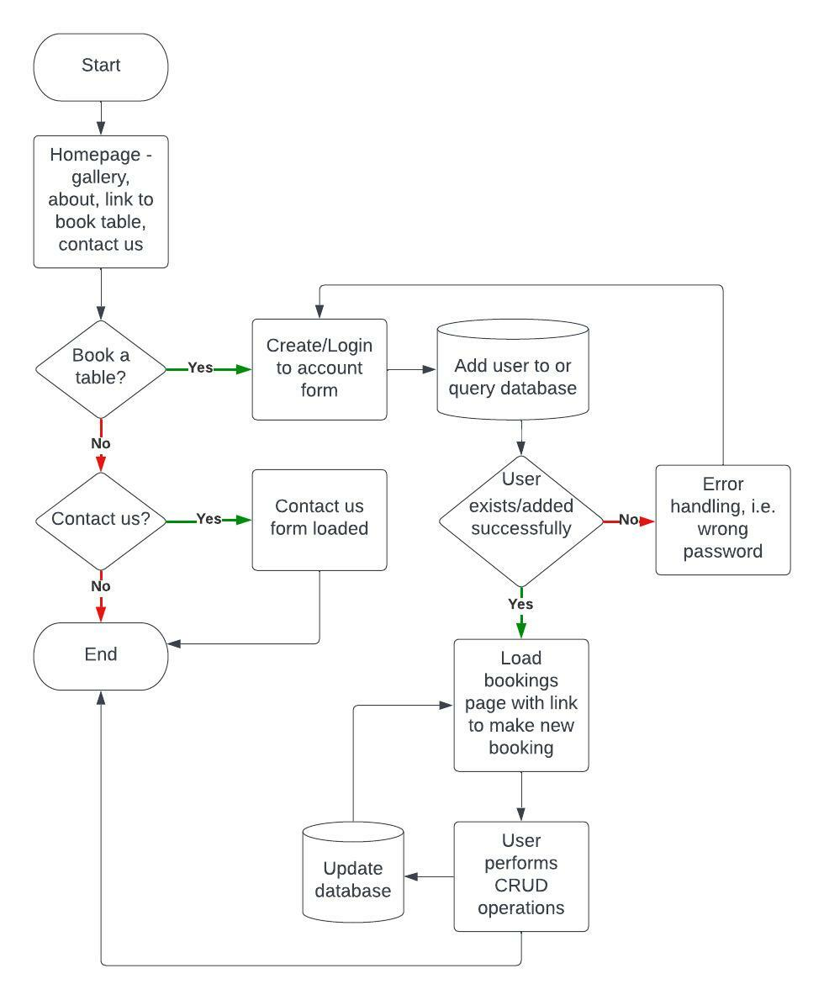
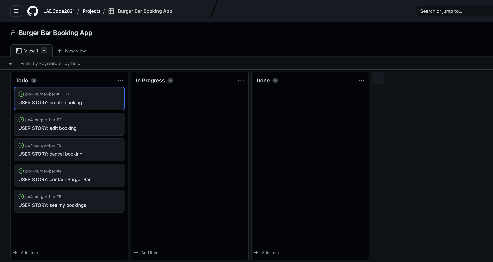

# PP4 - Burger Bar (Booking app)

Booking is an app designed to make booking a table, changing a book and cancelling a booking at a burger bar easier and more intuitive. The inspiration is taken from a local burger restaurant who on their website asks guests to message them on Whatsapp to book a table. They then manually reply to confirm if they have a table at that time and date. If the guest needs to change their booking, add more people to their booking, add special requests or cancel their booking, then again they have to get in contact via WhatsApp and wait for a manual reply.

Booking achieves the project goal by providing booking page based on principles of design thinking. I empathised with the user by putting myself in their position and anticipated what I think could improve the booking process. I asked myself what would could the site do that would improve the booking process and encourage users to return to the site and therefore the burger bar. I then examined what I would want to see to make me book and return to book again. This process formed my problem statement: "How do I develop a booking application that provides this functionality to the user?"

In terms of functionality users can make a booking (create element of CRUD), see their booking (read element of CRUD), edit their booking (update element of CRUD) or cancel a booking (delete element of CRUD). They must create/login into an account as initial authorisation step for defensive programming reasons and for GDPR reasons so only that person can access their bookings. The app is deployed on Heroku and uses postgresql as its backend database. Other frameworks and packages were used to deliver this app and are detailed towards the end.

[The live project can be viewed here.](https://pp4-burger-bar.herokuapp.com/)

# Planning

Following my empathise, questions and examine initial step I started mapping out what I felt was the minimum viable product in agile methodology out the requirements I'd identified in a flow diagram using [Lucid Charts](https://www.lucidchart.com/pages/). This allowed me to fully scope what I needed the tool to do and was useful to refer back to, to ensure I was staying on track with the intended minimum outputs for the project.

Please see my original plan below:

I then created a GitHub repository for my app and created a project. Once I'd created the project I setup user stories using automation which automatically added via a template user stories I created to my todo list in the project. I did this so I could track the progress of the functionality I had identified was required for this app.

Please see my initial user stories:

I largely stuck to the plan except I decided to update the worksheet all in one API call as the final task, rather than on two separate calls to updated sales first and then the pay calculations later. I read that it is best served to have as few API calls as possible in an application to keep loading/run-time as quick as possible.

Upon failing the initial submission of this project I then added new functionality. The assessor felt that if the user cannot access data in the Googlesheet and if they have to access the Googlesheet to obtain dealer id's then it renders the calculator less useful than just using the Googlesheet. To address this feedback I added functionality to allow the user to access previous sales data. I have changed the the programme so it displays a list of dealer id's in the programme before the user has to choose which dealer. The user should now not need to access the Googlesheet directly for any data input or retrieval.

# How to use Booking app

# Features

## Existing Features

## Future Features

# Technologies used

* Google Chrome
* GitHub
* GitPod
* Heroku

# Custom Models

# Testing

## Manual Testing

### Booking Form Tests

* Test form submits

When testing Booking Form on deployed project it would not submit. I tried different values in all fields and it would not submit. Upon investigation it turns out that ElephantSQL does not allow zeros at the start of integer fields. My phone number field was an integer field. SQLite3 in development just removed them so I was initially stumped.

To fix this error I converted the field to a CharField. This resolved the issue and I was able to submit the form on my deployed project.

* Test empty values in all fields (except date and time which are enforced)

I tested all fields individually as empty fields and all fields raised an error asking the user to fill in the field. This did raise the issue that I didn't actually want the special_requests field to have to have a value. To correct this I add null=True and blank=True to the CharField in models.py and re-migrated to the database.

* Test valid email address

I tested whether the field would allow me to enter an incorrect email. It didn't let me but the error message wasn't very intuitive so I imported Django Validators to my models and added the EmailValidator. This has more intuitive validation errors such as: please enter '@' in an email address.

* Test valid phone number

This test turned out to be the most important test. I had already fixed this field in my initial test. However, I discovered that I could essentially put any length of numbers in and it would submit. This would not work as I wanted at least the right length for a phone number. I changed the maxlength to 11 (standard UK phone number length) but discovered I couldn't also set a minimum length. So at this point a user could submit any set of numbers and letters up to 11. I researched and found the MinLengthValidator. I had already imported Django Validators so it was simple enough to add this validator to the field. When I reran the test however I discovered a fatal flaw in how my make_booking view had been setup. If the form input was invalid it was would just refresh the form, delete all the inputs and not display an error message. After a lot of research via Slack, Google and StackOverflow I discovered a neat solution and added an if else after form.is_valid that would return the form with the inputs as is and raise the error message underneath the field once I'd place an if messages code block to the make_bookings.html template.

### Contact Form Tests

* Test form submits on index.html/contact.html

When testing the Contact Form on deployed project it would not submit. I tried different values in all fields and it would not submit. Upon investigation it turned out to be the same issue that BookingForm had with ElephantSQL not allowing zeros at the start of integer fields. My phone number field was an integer field. SQLite3 in development just removed them so I was initially stumped.

To fix this error I converted the field to a CharField. This resolved the issue and I was able to submit the form on my deployed project. However, after submitting the form it took me to an incorrect page. I checked and I had added the wrong page in the url path in urls.py.

* Test empty values in all fields on index.html/contact.html (except date and time which are enforced)

I tested all fields individually as empty fields and all fields raised an error asking the user to fill in the field. This did raise the issue that I didn't actually want the special_requests field to have to have a value. To correct this I add null=True and blank=True to the CharField in models.py and re-migrated to the database.

* Test valid email address on index.html/contact.html

I tested whether the field would allow me to enter an incorrect email. It didn't let me but the error message wasn't very intuitive so I imported Django Validators to my models and added the EmailValidator. This has more intuitive validation errors such as: please enter '@' in an email address.

* Test valid phone number on index.html/contact.html

This test turned out to be the most important test. I had already fixed this field in my initial test. However, I discovered that I could essentially put any length of numbers in and it would submit. This would not work as I wanted at least the right length for a phone number. I changed the maxlength to 11 (standard UK phone number length) but discovered I couldn't also set a minimum length. So at this point a user could submit any set of numbers and letters up to 11. I researched and found the MinLengthValidator. I had already imported Django Validators so it was simple enough to add this validator to the field. When I reran the test however I discovered a fatal flaw in how my make_booking view had been setup. If the form input was invalid it was would just refresh the form, delete all the inputs and not display an error message. After a lot of research via Slack, Google and StackOverflow I discovered a neat solution and added an if else after form.is_valid that would return the form with the inputs as is and raise the error message underneath the field once I'd place an if messages code block to the make_bookings.html template.

## Remaining Bugs

## Validator Testing

I validated the code in PEP8 and no errors were returned:

# Deployment

# Technologies Used

I used the following technologies:

* Hardware: MacBook Pro
* GitHub
* GitPod
* Google Chrome, Firefox and Safari web browsers
* Django
* Heroku

# Credits

* Code Institute lesson content adapted in some areas - inline comments in code show where.

