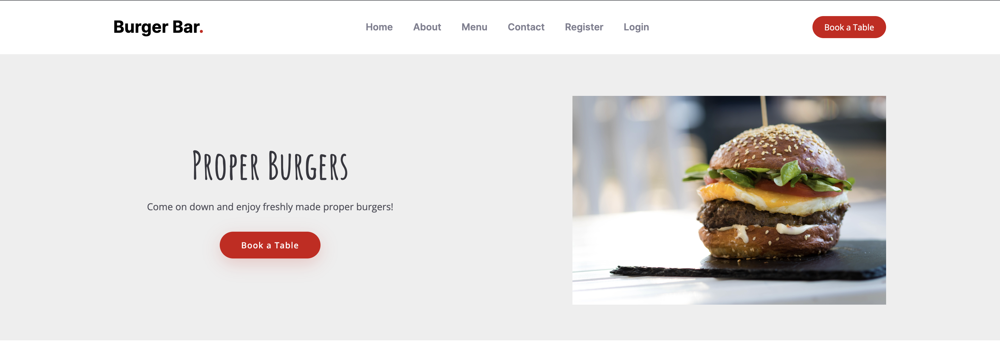

# PP4 - Burger Bar (Booking app)

Booking is an app designed to make booking a table, changing a booking and cancelling a booking at a burger bar easier and more intuitive. The inspiration is taken from a local burger restaurant who on their website asks guests to message them on Whatsapp to book a table. They then manually reply to confirm if they have a table at that time and date. If the guest needs to change their booking, add more people to their booking, add special requests or cancel their booking, then again they have to get in contact via WhatsApp and wait for a manual reply.

Booking achieves the project goal by providing booking page based on principles of design thinking. I empathised with the user by putting myself in their position and anticipated what I think could improve the booking process. I asked myself what would could the site do that would improve the booking process and encourage users to return to the site and therefore the burger bar. I then examined what I would want to see to make me book and return to book again. This process formed my problem statement: "How do I develop a booking application that provides this functionality to the user?"

In terms of functionality users can make a booking (create element of CRUD), see their booking (read element of CRUD), edit their booking (update element of CRUD) or cancel a booking (delete element of CRUD). Apart from creating a booking they must create/login into an account as initial authorisation step for defensive programming reasons and for GDPR reasons so only that person can access their bookings. The app is deployed on Heroku and uses Elephantsql as its backend database. Other frameworks and packages were used to deliver this app and are detailed towards the end.

[The live project can be viewed here.](https://pp4-burger-bar.herokuapp.com/)

# Planning

Following my empathise, questions and examine initial step I started mapping out what I felt was the minimum viable product in agile methodology out the requirements I'd identified in a flow diagram using [Lucid Charts](https://www.lucidchart.com/pages/). This allowed me to fully scope what I needed the tool to do and was useful to refer back to, to ensure I was staying on track with the intended minimum outputs for the project.

Please see my original plan below:

I then created a GitHub repository for my app and created a project. Once I'd created the project I setup user stories using automation which automatically added via a template user stories I created to my todo list in the project. I did this so I could track the progress of the functionality I had identified was required for this app.

Please see my initial user stories:

I completed all of these stories and then added further functionality. Staff also have a management page to view all bookings and contacts. A normal user also has the ability to manage their account by changing email and password.

# Features

## Existing Features

### Fixed Nav with anchor links on index.html and links back to index.html sections from all other pages except dedicated contact page

### Index.html Hero Section

### Index.html About Us Section

### Index.html Menu Section

### Index.html contact Section

### Book a Table Page

### Bookings page when logged in with edit, delete buttons

### Edit Booking page

### Booking when guest with link to register or login

### Manage Account Page when logged in

### Admin Management Page when logged in as staff

### Manage All Bookings when logged in as staff

### Manage Contacts when logged in as staff with option to delete

### Registration Page

### Login Page

### Log Out Page

### Footer on every page

## Future Features

# Custom Models

## BookingForm Model

I created a custom model for my BookingForm:

## ContactForm Model

I created a custom model for my ContactForm:

# Testing

## Manual Testing

### Test Navigation

I went through the whole navigation menu and all links worked. However, I have two nav snippets. One for index.html which anchors and stays on the homepage to all sections except making a booking. And another nav snippet for all other pages that takes the user back to anchored sections of the homepage accept for contact which takes the user to a dedicated contact page. The Contact link in the index.html nav was taking the user to the dedicated contact page. I noticed I had incorrectly put the url for the index nav in the if else statement in base.html. Once I updated this is worked.

### Booking Form Tests

* Test form submits

When testing Booking Form on deployed project it would not submit. I tried different values in all fields and it would not submit. Upon investigation it turns out that ElephantSQL does not allow zeros at the start of integer fields. My phone number field was an integer field. SQLite3 in development just removed them so I was initially stumped.

To fix this error I converted the field to a CharField. This resolved the issue and I was able to submit the form on my deployed project.

* Test empty values in all fields (except date and time which are enforced)

I tested all fields individually as empty fields and all fields raised an error asking the user to fill in the field. This did raise the issue that I didn't actually want the special_requests field to have to have a value. To correct this I add null=True and blank=True to the CharField in models.py and re-migrated to the database.

* Test valid email address

I tested whether the field would allow me to enter an incorrect email. It didn't let me but the error message wasn't very intuitive so I imported Django Validators to my models and added the EmailValidator. This has more intuitive validation errors such as: please enter '@' in an email address.

* Test valid phone number

This test turned out to be the most important test. I had already fixed this field in my initial test. However, I discovered that I could essentially put any length of numbers in and it would submit. This would not work as I wanted at least the right length for a phone number. I changed the maxlength to 11 (standard UK phone number length) but discovered I couldn't also set a minimum length. So at this point a user could submit any set of numbers and letters up to 11. I researched and found the MinLengthValidator. I had already imported Django Validators so it was simple enough to add this validator to the field. When I reran the test however I discovered a fatal flaw in how my make_booking view had been setup. If the form input was invalid it was would just refresh the form, delete all the inputs and not display an error message. After a lot of research via Slack, Google and StackOverflow I discovered a neat solution and added an if else after form.is_valid that would return the form with the inputs as is and raise the error message underneath the field once I'd place an if messages code block to the make_bookings.html template.

### Contact Form Tests

* Test form submits on index.html/contact.html

When testing the Contact Form on deployed project it would not submit. I tried different values in all fields and it would not submit. Upon investigation it turned out to be the same issue that BookingForm had with ElephantSQL not allowing zeros at the start of integer fields. My phone number field was an integer field. SQLite3 in development just removed them so I was initially stumped.

To fix this error I converted the field to a CharField. This resolved the issue and I was able to submit the form on my deployed project. However, after submitting the form it took me to an incorrect page. I checked and I had added the wrong page in the url path in urls.py.

* Test empty values in all fields on index.html/contact.html (except date and time which are enforced)

I tested all fields individually as empty fields and all fields raised an error asking the user to fill in the field.

* Test valid email address on index.html/contact.html

I tested whether the field would allow me to enter an incorrect email. It didn't let me but the error message wasn't very intuitive so I imported Django Validators to my models and added the EmailValidator. This has more intuitive validation errors such as: please enter '@' in an email address.

* Test valid phone number on index.html/contact.html

I had already fixed this field in my initial test. However, I discovered that I could essentially put any length of numbers in and it would submit. This would not work as I wanted at least the right length for a phone number. I changed the maxlength to 11 (standard UK phone number length) but discovered I couldn't also set a minimum length. So at this point a user could submit any set of numbers and letters up to 11. I researched and found the MinLengthValidator. I had already imported Django Validators so it was simple enough to add this validator to the field. When I reran the test however I discovered a fatal flaw in how my make_contact view had been setup. If the form input was invalid it was would just refresh the form, delete all the inputs and not display an error message. After a lot of research via Slack, Google and StackOverflow I discovered a neat solution and added an if else after form.is_valid that would return the form with the inputs as is and raise the error message underneath the field once I'd place an if messages code block to the contact.html template/index.html contact section.

### Registration Form Tests

* Test Registration form submits

When testing Booking Form on deployed project it submitted but I got a Server 500 error. I went back over the tutorials and realised I had missed off the ACCOUNT_EMAIL_VERIFICATION = 'none' in settings.py. Once I fixed this it worked correctly. However, the nav options to logout and manage account were missing. I noticed in the nav section that I had misspelled user in the elif that loads those options if user is authenticated.

* Test empty values in all fields

I tested all fields individually as empty fields and all fields raised an error asking the user to fill in the field.

* Test valid email address

I tested whether the field would allow me to enter an incorrect email. It didn't let me and asked me please enter '@' in an email address.

* Test existing account

I tried to create an account with existing email address and it raised an error telling me a user with that name already exists.

## Remaining Bugs

## Validator Testing

I validated views.py, models.py and forms.py in Code Institute PEP8 Linter (https://pep8ci.herokuapp.com/) and no errors were returned.

# Deployment

I followed the following steps to deploy my app to Heroku (these are based on the lessons from Hello Django walkthrough):

* Install the Heroku CLI in Gitpod WorkSpace using curl command (curl https://cli-assets.heroku.com/install.sh | sh)
* Login to Heroku using command (heroku login -i) in Gitpod using username and API (not password due to 2fa)
* Install Postgres using command (pip3 install psycopg2-binary)
* Install webserver wirg gunicorn using command (pip3 install gunicorn)
* Create a requirements file using command (pip3 freeze --local > requirements.txt)
* Create the app using command heroku apps:create pp4-burger-bar --region eu
* In ElephantSQL account create New Instance
* Return to the ElephantSQL dashboard and click on the database instance name for this project
* Add a Config Var called DATABASE_URL and input database URL from ElephantSQL
* Install dj-database-url using command (pip3 install dj-database-url)
* Refreeze the requirements file using command (freeze --local > requirements.txt)
* Comment out existing database settings in settings.py
* Add new database setting including database URL from elephant into settings.py
* Run migrations using command (python3 manage.py migrate)
* Check .gitignore file includes all files I don't want to commit to repo
* Add, Commit and Push to GitHub
* Push to remote repo using command (git push origin main)
* Deploy app to Heroku
* Disable collect static
Redeploy app to Heroku
* Create a new file: Procfile
* Add gunicorn to Procfile
* Add, commit, push the Procfile to the git Repo
* Push to remote repo using command (git push origin main)
* Click Open App
* Put Herokuto app url in ALLOWED_HOSTS in settings.py
* Add import os to settings.py
* Open your pp4-burger-bar app in Heroku
* Open the Deploy Tab
* Select a Deployment Method Option
* Search for pp4-burger-bar and the connect and enable automatic deploys
* Get the Secret Key value using an environment variable in settings.py (SECRET_KEY = os.environ.get('SECRET_KEY', '---secretkeyvalue---’))
* Replace the Heroku host value in ALLOWED_HOSTS ([os.environ.get('HEROKU_HOSTNAME')]
* Add Heroku HOST_NAME variable to Config Vars in Heroku settings (pp4-burger-bar.herokuapp.com)
* Add, Commit and Push to GitHub
* Add a new environment variable (development = os.environ.get('DEVELOPMENT', False) in settings.py
* Set Debug to development in settings.py
"* Uncomment original database settings and paste in the following setup from course instructions: if development:
    DATABASES = {
        'default': {
            'ENGINE': 'django.db.backends.sqlite3',
            'NAME': BASE_DIR / 'db.sqlite3',
        }
    }
else:
    DATABASES = {
        'default': dj_database_url.parse(os.environ.get('DATABASE_URL'))
    }"
* Add a new GitPod workspace variable that sets DEVELOPMENT to TRUE
"* Update ALLOWED_HOST to: if development:
    ALLOWED_HOSTS = ['localhost']
else:
    ALLOWED_HOSTS = [os.environ.get('HEROKU_HOSTNAME')]"
* Add, Commit and Push to GitHub
* Check app has automatically deployed to Heroku
* Replace the default SECRET KEY with a blank string (SECRET_KEY = os.environ.get('SECRET_KEY', '')
* Generate and copy a new Django Secret Key from a secret_key generator found on Google
* Add a new GitPod variable with generated secret_key
* Generate and copy another new Django Secret Key from a secret_key generator found on Google
* Add new SECRET_KEY as a config var in Heroku
* Add, Commit and Push to GitHub
* Push to heroku

# Technologies Used

I used the following technologies:

* Hardware: MacBook Pro
* GitHub
* GitPod
* Google Chrome, Firefox and Safari web browsers
* Django
* Heroku
* Cloudinary

# Credits

* Image credits in image alt text

* Some HTML, CSS and JS adapted from: https://bootstrapmade.com/yummy-bootstrap-restaurant-website-template/.

* Code Institute lesson content adapted in some areas.

* About us section copy inspired by: https://www.conniescookieskansascity.com/about

